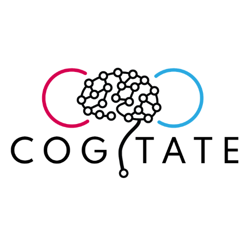
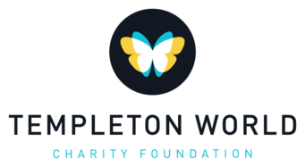

# Genemede

Welcome to the GENEMEDE documentation.

GENEMEDE (GEneric NEuro MEtadata DEscriptors) is a generic metadata framework that may be used to comprehensively describe a neuroscience experiment.

The tool and the website is still a work in progress, so please expect a lot of changes.

## Funding
This project was made possible through the support of a grant from Templeton World Charity Foundation, Inc. The opinions expressed in this publication(website) are those of the author(s) and do not necessarily reflect the views of Templeton World Charity Foundation, Inc.

The tool has been developed as a part of the ARC-Cogitate project.

